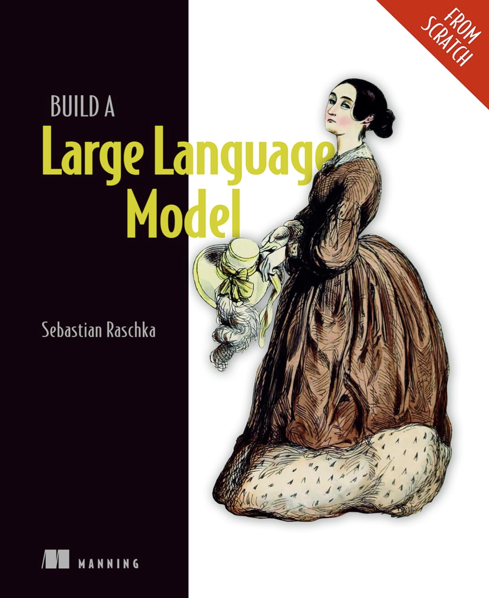
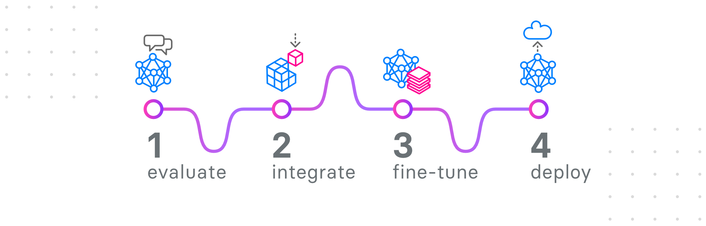
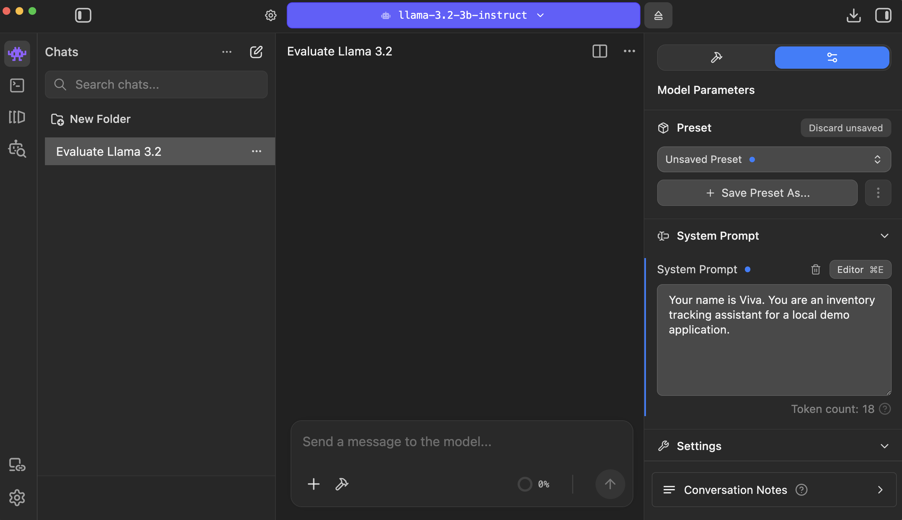
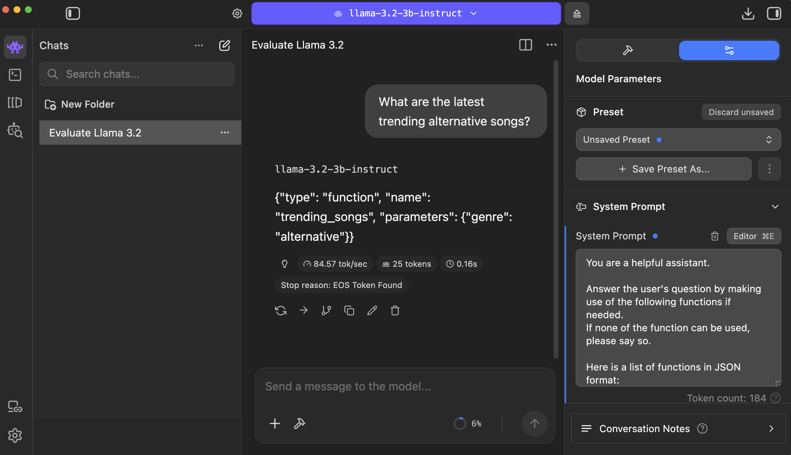
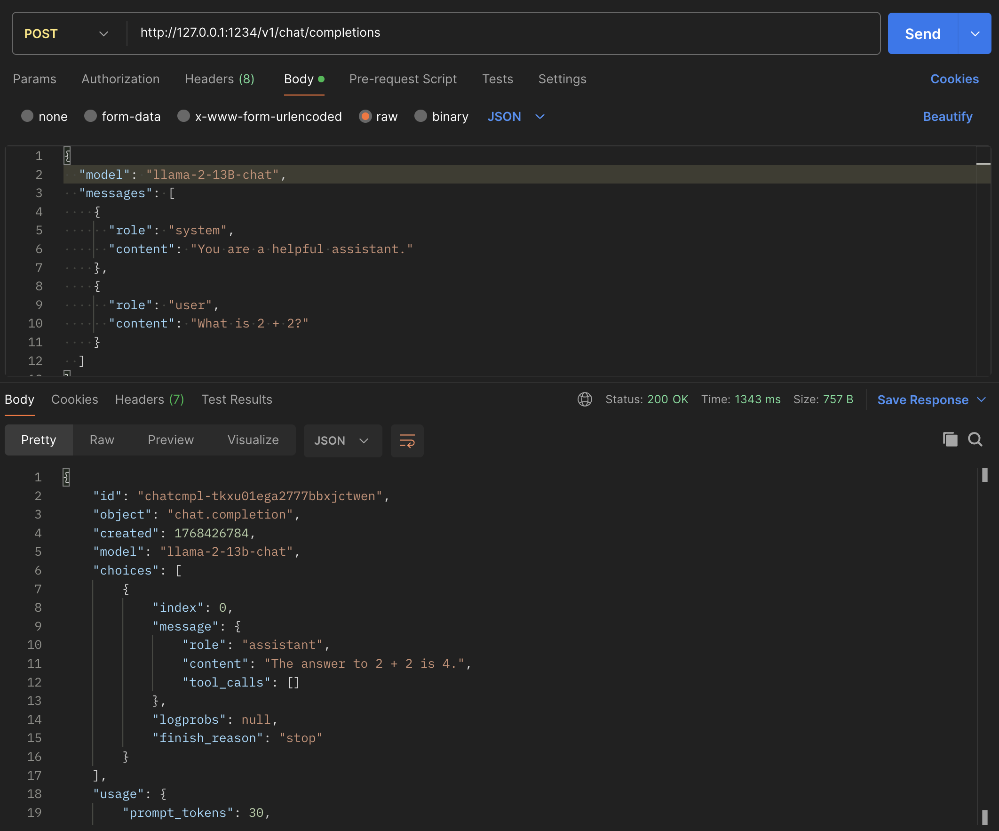

# Building a Chat Bot

> A practical, end-to-end workflow for tool-calling chat bots

## Overview

Modern chat bots are powered by *large language models* (LLMs). These models can understand and generate human language, making them ideal for conversational tasks.

Instead of training an LLM from scratch (a costly and time-intensive process), we start with an existing *pre-trained* model and adapt it to our needs. This process is known as *fine-tuning*.

### Pre-training

Pre-trained models have already learned general language patterns by analyzing vast amounts of text. This is done with *unsupervised training*, where a model iteratively learns to generate the next word in a sequence.

The [Build a Large Language Model (From Scratch)](https://www.amazon.com/Build-Large-Language-Model-Scratch/dp/1633437167) book by Sebastian Raschka is a great resource for understanding how pre-training works in detail.



This tutorial is designed to help you integrate an LLM into your application as quickly as possible, which doesn't require in-depth knowledge.

### Fine-tuning

Fine-tuning is the process of teaching a pre-trained model to perform specialized tasks, which could be anything from updating database records to executing commands and accessing APIs.

Some examples of fine-tuned models in the medical field:

+ [Medical Gemma](https://huggingface.co/collections/google/medgemma-release-680aade845f90bec6a3f60c4)
+ [Clinical Bert](https://huggingface.co/medicalai/ClinicalBERT)
+ [Medical GPT](https://huggingface.co/dousery/medical-reasoning-gpt-oss-20b)

### Step-by-Step Process

In this tutorial, we'll walk through the complete steps for selecting an LLM, integrating it with your application, locking in the desired behavior by fine-tuning, and deploying it to production.



1. **Evaluate** LLMs with *system prompts* and *few-shot prompts*
2. **Integrate** an LLM with your application by using *Tool Calling*, *Structured Output*, or *Model Context Protocol*
3. **Fine-tune** the selected model on your use case
3. **Deploy** the model to inference endpoints

Before we jump into integration and training, we’ll use prompts to evaluate models, learn how they are packaged on the Hugging Face Hub, and preview the Chat API we’ll use later for integration.

## Evaluating Models

[Few-shot prompting](https://www.ibm.com/think/topics/few-shot-prompting) refers to the process of providing an AI model with a few examples of a task to guide its performance. This lets you quickly evaluate an LLM's behavior and capabilities before investing time in integration and training. The examples you use in few-shot prompts can later be used as the foundation for a training dataset.

### Exploring Models

[LM Studio](https://lmstudio.ai/) provides a simple and visual way to experiment with multiple large language models on your computer. It uses the [Llama.cpp](https://github.com/ggml-org/llama.cpp) hardware-accelerated engine under the hood to run LLMs locally.

Llama.cpp includes a command line utility called [Llama.cpp Server](https://github.com/ggml-org/llama.cpp/tree/master/tools/server), which starts a web server with a given IP address and port number, and loads the specified large language model. This makes talking to an LLM as simple as sending REST API requests to a local server.

For developers that prefer using command-line tools, [Ollama](https://ollama.com/) CLI provides the same functionality as LM Studio. However, LM Studio is more beginner-friendly and has a rich graphical interface, so it's used in this tutorial.

The following table provides a rough starting point for choosing model sizes to experiment with, depending on the amount of system memory available:

|Model Size|System Memory|
|-|-|
|3 - 8 billion parameters|`16 GB` RAM|
|13 billion parameters|`32 GB` RAM|
|30 - 34 billion parameters|`64 GB` RAM|

When first launching LM Studio, you'll be asked to choose a UI complexity level and download the first model. Select *Power User* and skip downloading a model for now - we'll look at model selection next.

The **Discover** tab in LM Studio is a simple browsing interface for exploring models hosted on the [Hugging Face Hub](https://huggingface.co/models), which is like GitHub for machine learning models.

Each model is stored as a Git repository, typically containing a *README* and a set of model files. Hugging Face uses Git Large File Storage (LFS) under the hood to manage large assets such as model weights.

The most common formats you’ll encounter for model weights are [Safetensors](https://huggingface.co/docs/text-generation-inference/en/conceptual/safetensors), [GGUF](https://huggingface.co/docs/hub/en/gguf), and [MLX](https://huggingface.co/docs/hub/en/mlx):

+ Safetensors (`.safetensors`)  
This format is commonly used for training and fine-tuning. Models available in this format can typically be adapted for specific tasks.
+ GGUF (`.gguf`)  
This format is optimized for inference. GGUF models are designed to run efficiently in tools like LM Studio and llama.cpp, but cannot be further trained.
+ MLX (`.mlx`)  
This format is optimized for inference like GGUF, but [designed specifically for Apple GPUs](https://contracollective.com/blog/mlx-vs-llama-cpp-apple-silicon-local-ai), running efficiently in tools like LM Studio and Ollama.

### Model Capabilities

The LM Studio model browser uses badges to highlight common model capabilities:

|Badge|Capability|
|-|-|
|🛠️ Tool Calling|The model can call external tools by emitting structured JSON|
|🧠 Reasoning|The model is optimized for multi-step reasoning and problem solving|
|👁️ Vision|The model can process and reason about images|

### Downloading a Model

Select a model for experimentation and click **Download** at the bottom of the LM Studio browser. Once a model is downloaded, it can be selected at the top of the LM Studio window. The **Chat** tab can then be used to talk to the model.

### Prompts

Instructing an LLM is fundamentally the process of communicating requirements:

- **System Prompt** defines the model's role, behavior, and constraints (see [examples of system prompts](https://huggingface.co/datasets/danielrosehill/System-Prompt-Library))
- **User Prompt** represents a user question
- **Assistant Response** demonstrates the ideal reply the model should produce

Taken together, these three messages describe a "teachable moment": a single row of a training dataset, or a single conversation in a few-shot chat.

In LM Studio, a System Prompt can be entered by clicking **Configuration** in the sidebar of the **Chat** tab, which could be opened by clicking on *Show Sidebar* button at the top right corner of the screen.



### Tool Calling

Large Language Models (especially the ones meant for following instructions, with *Instruct* in their name) know how emit Python or JSON in response to natural language prompts.

This is known as *tool calling* or *function calling*, and it's documented in guides for all major models:

+ [LLama Tool Calling](https://llama.developer.meta.com/docs/features/tool-calling/)
+ [Gemma Function Calling](https://ai.google.dev/gemma/docs/capabilities/function-calling)
+ [Qwen Function Calling](https://qwen.readthedocs.io/en/latest/framework/function_call.html)

Tool Calling is a key capability that allows LLMs to be integrated with web applications, cloud services, command line utilities, smart home and industrial automation systems, and robots.

You can quickly evaluate a model's performance with tool calling by including the instructions in its system prompt, for example:

```
You are a helpful assistant.

Answer the user's question by making use of the following functions if needed. If none of the function can be used, please say so.

Here is a list of functions in JSON format:

{
  "type": "function",
  "function": {
    "name": "trending_songs",
    "description": "Returns the trending songs on a Music site",
    "parameters": [
      {
        "type": "object",
        "properties": [
          {
            "n": {
              "type": "object",
              "description": "The number of songs to return"
            }
          },
          {
            "genre": {
              "type": "object",
              "description": "The genre of the songs to return"
            }
          }
        ],
        "required": ["n"]
      }
    ]
  }
}

Return function calls in JSON format.
```

When a relevant question is asked, the model will respond with a data structure:



This data structure matches the [JSON Schema](https://json-schema.org/) specified for each parameter in the function call definition.

## Integration

Next we'll look at how to interact with LLMs by sending REST API requests to a locally running LLM server by using the *Chat API*.

### Chat API

When models are deployed in production, they are typically accessed through a *chat-style API*.

You send a list of messages with roles such as `system` (system prompt), `user` (user question), and `assistant` (agent response) and the LLM server runs [inference](https://research.ibm.com/blog/AI-inference-explained) on the model to predict the next agent response.

The most common chat APIs are:

- [Hugging Face Chat API](https://huggingface.co/docs/text-generation-inference/en/index)  
  Hugging Face provides a chat-oriented API used by *Hugging Face Inference Endpoints* and other services that deploy models directly using Hugging Face Text Generation Interface.

- [OpenAI-compatible Chat API](https://developers.openai.com/api/reference/overview)  
  Many cloud providers expose deployed models through APIs that follow the same request and response structure as OpenAI’s Chat Completions API. Even when the underlying model is hosted on Hugging Face or uses a different inference engine, the API surface is often kept OpenAI-compatible for portability.

Both of these APIs describe a list of `messages` between the user and the agent and support system prompts, tool calls, and structured output.

Here's an example of an OpenAI-compatible Chat API request:

```json
{
  "model": "llama-3.2-3b-instruct",
  "messages": [
    {
      "role": "system",
      "content": "You are a helpful assistant."
    },
    {
      "role": "user",
      "content": "What is 2 + 2?"
    }
  ]
}
```

This payload is typically sent to a *chat completion* endpoint of the running LLM server:

```bash
POST /v1/chat/completions
```

The easiest way to experiment with Chat API is by using the **Server** functionality in LM Studio, available on **Developer** tab:

+ Click **Status** switch to run the server.
+ Server **address** and **port** will be displayed in the same box, `http://127.0.0.1:1234` by default.

Try using [Postman](https://www.postman.com/) or [Bruno](https://www.usebruno.com/) to send an `application/json` payload to http://127.0.0.1:1234/v1/chat/completions (LM Studio’s OpenAI-compatible endpoint):



### Tool Calls

The Chat API supports a strongly-typed schema for advertising and making tool calls, as well as returning tool call results.

In the following request, tool calls are advertised to the agent by including them in the `tools` array, using exactly the same format we've used earlier to describe them in the system prompt:

```json
{
  "model": "Llama-3.2-3B-Instruct",
  "messages": [
    {
      "role": "user",
      "content": "What is the weather in Menlo Park?"
    }
  ],
  "tools": [
    {
      "type": "function",
      "function": {
        "name": "get_weather",
        "description": "Retrieve the current temperature for a specified location",
        "parameters": {
          "type": "object",
          "properties": {
            "location": {
              "type": "string",
              "description": "The city, state, or country for which to fetch the temperature"
            }
          },
          "required": ["location"],
          "additionalProperties": false
        },
        "strict": true
      }
    }
  ]
}
```

The agent responds with empty message `content` and tool calls listed in `tool_calls` array:

```json
{
  "model": "llama-3.2-3b-instruct",
  "choices": [
    {
      "index": 0,
      "message": {
        "role": "assistant",
        "content": "",
        "reasoning_content": "",
        "tool_calls": [
          {
            "type": "function",
            "id": "311592109",
            "function": {
              "name": "get_weather",
              "arguments": "{\"location\":\"Menlo Park\"}"
            }
          }
        ]
      },
      "finish_reason": "tool_calls"
    }
  ]
}
```

This makes tool calls simple to extract from the JSON structure and execute for the program controlling the LLM.

### Structured Output

*Structured Output* is a way to reliably constrain the output of an LLM to a data structure.

This feature is similar to tool calls in that it allows LLMs to return JSON or Python data structures in response to natural language prompts, and it's suppored by all major models:

* [Llama Structured Output](https://llama.developer.meta.com/docs/features/structured-output/)
* [Gemma Structured Output](https://ai.google.dev/gemini-api/docs/structured-output?example=recipe)
* [Qwen Structured Output](https://www.alibabacloud.com/help/en/model-studio/qwen-structured-output)

To enable Structured Output, include the [JSON Schema](https://json-schema.org/) for validating the response in `json_schema` under `response_format`:

```json
{
  "model": "local",
  "messages": [
    {
      "role": "system",
      "content": "You are a helpful jokester."
    },
    {
      "role": "user",
      "content": "Tell me a joke."
    }
  ],
  "response_format": {
    "type": "json_schema",
    "json_schema": {
      "name": "joke_response",
      "strict": "true",
      "schema": {
        "type": "object",
        "properties": {
          "joke": {
            "type": "string"
          }
        },
        "required": ["joke"]
      }
    }
  }
}
```

The model response will include the data structure inside the message `content` rather than in the `tool_calls` array:

```json
{
  "model": "llama-3.2-3b-instruct",
  "choices": [
    {
      "index": 0,
      "message": {
        "role": "assistant",
        "content": "{\n  \"joke\": \"A man walked into a library and asked the librarian, 'Do you have any books on Pavlov's dogs and Schrödinger's cat?' The librarian replied, 'It rings a bell, but I'm not sure if it's here or not.'\"\n}",
        "reasoning_content": "",
        "tool_calls": []
      },
      "finish_reason": "stop"
    }
  ]
}
```

### Model Context Protocol

Model Context Protocol (MCP) is a [standard developed by Anthropic](https://www.anthropic.com/news/model-context-protocol) to simplify integrating AI into applications.

The [MCP specification](https://modelcontextprotocol.io/docs/getting-started/intro) reduces the integration surface between AI agents and other layers of the software stack down to a simple class with methods which the agents can call to perform actions and retrieve information.

MCP addresses the shortcomings of *Tool Calling* and *Structured Output*:

* **Structured Output** can only describe a single data structure with JSON Schema. The instructions for filling out this data structure must be included in the system prompt.
* **Tool Calling** expands on this by providing AI agents with multiple data structures they can output. The system prompt explains how to work with these tools.

The system prompt is a part of the agent's *context*. Model Context Protocol lets you switch an AI agent's context *on the fly*, giving it a system prompt and tool calls for working on a specific task only when needed:

* Without MCP, we would have to create our own system that can detect the task the user is working on and load the appropriate *system prompt* and *tools* to enable the AI agent to help with that task.
* With MCP, AI agents can query a server to determine which tools are available to use, and how to use them. This lets you build a large *directory* of tools the agent can use, and even include prompts - all without any custom coding on your part.

MCP servers are simple to setup for [many languages and frameworks](https://modelcontextprotocol.io/docs/sdk):

* A good starting point is using the [C# SDK](https://github.com/modelcontextprotocol/csharp-sdk) to standup a [server that lets AI agents query the National Weather Service](https://modelcontextprotocol.io/docs/develop/build-server#c%23).
* Microsoft also published tutorials on [integrating an AI agent with a TODO list app](https://learn.microsoft.com/en-us/azure/app-service/tutorial-ai-model-context-protocol-server-dotnet) connected to a database, and an [echo server](https://devblogs.microsoft.com/dotnet/build-a-model-context-protocol-mcp-server-in-csharp/).
* The companion example created as part of this article [integrates an AI agent with an inventory tracking web application](https://github.com/01binary/inventory-llm) which includes a React frontend, a .NET backend, and a SQLite database.

Now that we've explored all the major methods for integrating AI into applications and understand how to use the Chat API, it's time to explore *fine-tuning*: a way to lock-in the behavior defined by a general system prompt and few-shot example conversations that steer the AI agent toward desired outcomes for reliable production performance.

## Fine-Tuning

### Environment Setup

Data scientists use *Scientific computing notebooks* to fine-tune Large Language Models. These notebooks are divided into cells, with some cells containing text and graphics formatted with Markdown, and others containing Python code.

Rather than configuring a scientific computing environment on your own machine, we’ll use the [Kaggle](https://www.kaggle.com/) cloud environment. This avoids many common hardware and software setup issues and lets you start training models immediately:

- **Hardware**: Data-center GPUs such as the NVIDIA [T4](https://www.newegg.com/p/1FT-000P-005F0) or [P100](https://www.newegg.com/nvidia-900-2h400-0000-000-tesla-p100-16gb-graphics-card/p/2VV-000H-000J6) are expensive and typically require a custom PC or server. Both are supported in Kaggle out-of-the-box.
- **Software**: Local Python and ML setups often run into dependency and version conflicts. Using a cloud Python notebook is essentially like spinning up a VM: everything is setup from scratch every time, exactly the right way.

Create a Kaggle account to get started. Kaggle provides free compute credits each month, with the option to add a credit card for additional usage.

When you’re finished, **stop your notebook**. Kaggle runs each notebook on a virtual machine, and leaving it running will continue to use your available credits.

### Loading a Pre-Trained Model

In this section we'll pull a pre-trained AI model from Hugging Face Hub, and load it in our Python notebook.

**Llama 3.2** is a family of large language models chosen for this tutorial because it strikes a good balance between capability, accessibility, and ecosystem support:

- Well documented, with extensive examples (see the [Llama Cookbook](https://github.com/meta-llama/llama-cookbook))
- Available in both base (*pre-trained*) and *instruction-tuned* variants
- Available in [quantized](https://www.newline.co/@zaoyang/4-bit-vs-8-bit-quantization-key-differences--842272c7) form to reduce memory requirements
- Supported by Kaggle’s cloud environment, with no local hardware setup required
- Fully supported by the [Unsloth](https://unsloth.ai/) library for fast fine-tuning
- Deployable to common cloud platforms such as [Microsoft Foundry](https://techcommunity.microsoft.com/blog/azure-ai-foundry-blog/meta%E2%80%99s-new-llama-3-2-slms-and-image-reasoning-models-now-available-on-azure-ai-m/4255167)
- Supports external tool calling when using the *Instruct* variant

We use the **Unsloth** library to load and fine-tune the model. Unsloth provides a ready-to-use [Python notebook template for Kaggle](https://www.kaggle.com/notebooks/welcome?src=https://github.com/unslothai/notebooks/blob/main/nb/Kaggle-Llama3.2_(1B_and_3B)-Conversational.ipynb&accelerator=nvidiaTeslaT4) that includes all required setup code.

> For a deeper introduction to Unsloth, see the official [fine-tuning with Unsloth](https://docs.unsloth.ai/get-started/fine-tuning-llms-guide) guide.

This notebook template from the Unsloth team was used as the basis for the [fine-tuning](./fine-tune.py) and [inference](./inference.py) scripts in this repository.

The fine-tuning script in this repository uses:

**`unsloth/Llama-3.2-3B-Instruct-bnb-4bit`**

This model is:
- Pre-trained on large-scale text data
- Instruction-tuned for conversational behavior and tool calling
- Quantized to 4-bit using [Bits and Bytes format](https://huggingface.co/docs/transformers/en/quantization/bitsandbytes) to reduce GPU memory usage

Other available Llama 3.2 variants include:

|Model|Description
|-|-|
|`unsloth/Llama-3.2-1B-bnb-4bit`|1B-parameter pre-trained model, quantized to 4-bit
|`unsloth/Llama-3.2-3B-bnb-4bit`|3B-parameter pre-trained model, quantized to 4-bit
|`unsloth/Llama-3.2-1B-Instruct-bnb-4bit`|1B-parameter instruction-tuned model, quantized to 4-bit

### Preparing a Dataset

In this section we look inside a typical dataset used to train AI models and discuss strategies for generating one. After generating the dataset we upload it to Kaggle registry so that we can use it for training in the next step.

### Dataset Formats

Several compact dataset formats are commonly used for instruction fine-tuning. Fortunately, these formats closely resemble Chat API request payloads, so if you experimented with the Chat API earlier, the dataset structure will already feel familiar.

In this tutorial, we focus on **ShareGPT format**, but the closely related **Hugging Face Generic format** is also shown for reference. Unsloth provides utilities to convert between these formats if needed.

#### ShareGPT Format

In ShareGPT format, the dataset is stored as a `.jsonl` (*JSON Lines*) file. Each line represents one conversation and contains a `conversations` array.

Each entry in the array specifies the message source (`from`) and the message content (`value`):

| `from` value | Description       |
|--------------|-------------------|
| `system`     | System prompt     |
| `human`      | User question     |
| `gpt`        | Chat bot response |

Example of a single dataset row (shown as formatted JSON):

```json
{
  "conversations": [
    { "from": "system", "value": "You are an assistant" },
    { "from": "human", "value": "What is 2+2?" },
    { "from": "gpt", "value": "It's 4." }
  ]
}
```

An example of a published dataset in ShareGPT format can be found here:
[mlabonne/FineTome-100k](https://huggingface.co/datasets/mlabonne/FineTome-100k).

#### Hugging Face Generic Format

The Hugging Face Generic format uses the same structure (a `.jsonl` file with one conversation per line) but with slightly different field names - `role` instead of `from` and `content` instead of `value`:

| `from` value | Description       |
|--------------|-------------------|
| `system`     | System prompt     |
| `user`       | User question     |
| `assistant`  | Chat bot response |

An example dataset in this format is available at: [allenai/tulu-3-sft-mixture](https://huggingface.co/datasets/allenai/tulu-3-sft-mixture/viewer/default/train).

### Uploading the Dataset

In order to use an instruction prompt dataset during training, it has to be uploaded to a repository like [Huggingface](https://huggingface.co/datasets) or [Kaggle](https://www.kaggle.com/datasets). Both function like "GitHub for data science" and support pushing and pulling AI models and datasets.

Datasets are stored either directly as `JSONL` and `CSV`, or in a sharded format called [Parquet](https://www.snowflake.com/en/fundamentals/parquet/). Using shards lets repositories split the dataset into many pieces for efficient storage.

Install Kaggle CLI:

```bash
pip install --break-system-packages kaggle
```

Go to [Kaggle Settings](https://www.kaggle.com/settings), scroll down to *Legacy API Credentials* and click **Create Legacy API Key**, which will download `kaggle.json` with your credentials.

Move `kaggle.json` to the Kaggle configuration directory and set permissions:
```
mv ~/Downloads/kaggle.json ~/.kaggle
chmod 600 ~/.kaggle/kaggle.json
```

Finally, upload the dataset:

```bash
kaggle datasets create -p upload
```

The following can be used to update the dataset later without having to re-create it:

```bash
kaggle datasets version -p upload -m "Update message"
```

For more information, see the [Kaggle API documentation](https://www.kaggle.com/docs/api#getting-started-installation-&-authentication).

Once the dataset is uploaded, it can be added to the **Inputs** section displayed in a side-bar of a Kaggle notebook. When the notebook is executed, this will cause the dataset to be automatically downloaded to the working directory of the virtual machine spun up by Kaggle to run the notebook.

## Training

This section covers how the model is fine-tuned using supervised learning, parameter-efficient techniques, and configurable training settings.

### Supervised Fine-Tuning Trainer

The [Unsloth Kaggle template](https://www.kaggle.com/notebooks/welcome?src=https://github.com/unslothai/notebooks/blob/main/nb/Kaggle-Llama3.2_(1B_and_3B)-Conversational.ipynb&accelerator=nvidiaTeslaT4) used in this tutorial relies on the [Hugging Face Supervised Fine-Tuning (SFT) Trainer](https://huggingface.co/docs/trl/en/sft_trainer).

Supervised fine-tuning trains the model using labeled examples, where each input prompt is paired with an expected response. This allows the model to learn how to map questions to appropriate answers.

This differs from pre-training, where the model is trained on large volumes of unlabeled text and learns by predicting the next token without explicit guidance.

### Low-Rank Adaptation

The Unsloth template also uses [Low-Rank Adaptation (LoRA)](https://docs.unsloth.ai/get-started/fine-tuning-llms-guide/lora-hyperparameters-guide), a parameter-efficient fine-tuning technique.

LoRA works by freezing the original pre-trained model weights and introducing a small number of additional trainable matrices. Only these new weights are updated during training, which significantly reduces memory usage and training cost.

As described by the Unsloth team:

> In LLMs, we have model weights. Llama 70B has 70 billion numbers. Instead of changing all 70B numbers, we add thin matrices A and B to each weight and optimize those instead. This typically means training around 1% of the total parameters.

### Hyperparameters

Model weights are commonly referred to as *parameters*. To avoid confusion, the configuration values that control *how* those parameters are trained are called *hyperparameters*.

In this tutorial, hyperparameters fall into two main categories:
- **LoRA hyperparameters**, which control *what parts of the model are trainable*
- **Training hyperparameters**, which control *how training proceeds*

Together, these settings determine training stability, speed, memory usage, and the quality of the final model.

#### LoRA Hyperparameters

Low-Rank Adaptation (LoRA) introduces a small number of trainable weights on top of a frozen pre-trained model. The following hyperparameters control how those additional weights are configured:

| Hyperparameter | Description | Practical Impact |
|---------------|-------------|------------------|
| `r` (Rank) | Number of trainable dimensions added per adapted layer | Higher values increase learning capacity and memory usage; common values are 8–64 |
| `lora_alpha` | Scaling factor applied to LoRA updates | Higher values increase the influence of LoRA weights during training |
| `lora_dropout` | Dropout applied to LoRA layers | Adds regularization; often set to 0 for instruction fine-tuning |
| `target_modules` | Model submodules to apply LoRA to (e.g., attention and MLP projections) | Controls *where* the model can learn; more modules = higher capacity and cost |
| `bias` | Whether bias parameters are trained | Usually set to `none` to minimize trainable parameters |
| `use_rslora` | Enables rank-stabilized LoRA | Improves numerical stability at higher ranks (disabled here) |
| `loftq_config` | Enables LoRA-aware quantization | Used when combining LoRA with advanced quantization techniques |
| `use_gradient_checkpointing` | Trades compute for memory by recomputing activations | Enables training larger models on limited hardware |
| `random_state` | Seed controlling LoRA initialization | Ensures reproducibility of training runs |

These hyperparameters determine *how much* the model can change and *where* those changes are applied.

#### Training Hyperparameters

Training hyperparameters control how the model learns from the dataset and how gradients are applied over time:

| Hyperparameter | Description | Practical Impact |
|---------------|-------------|------------------|
| `learning_rate` | Step size used when updating trainable parameters | Too high can cause instability; too low slows learning |
| `num_train_epochs` | Number of full passes over the dataset | More epochs improve learning but increase overfitting risk |
| `max_steps` | Maximum number of training steps | Used as an alternative to epochs for fine-grained control |
| `per_device_train_batch_size` | Number of samples processed per GPU step | Larger batches improve stability but increase memory use |
| `gradient_accumulation_steps` | Number of steps to accumulate gradients before updating | Simulates larger batch sizes on limited hardware |
| `warmup_steps` | Number of steps used to gradually increase learning rate | Stabilizes early training |
| `lr_scheduler_type` | Learning rate schedule over time | Controls how learning rate decays during training |
| `weight_decay` | Regularization applied to model weights | Helps prevent overfitting |
| `optim` | Optimizer used to update parameters | Memory-efficient optimizers (e.g., `adamw_8bit`) reduce GPU usage |
| `packing` | Packs multiple short samples into a single sequence | Improves training efficiency for short conversations |
| `max_seq_length` | Maximum token length of training samples | Higher values increase memory usage and context capacity |
| `seed` | Random seed for training | Ensures reproducibility |
| `logging_steps` | Frequency of training logs | Affects observability, not training quality |

These settings control the *learning dynamics* - how fast the model learns, how stable training is, and how efficiently hardware is used.

In practice, fine-tuning usually begins with conservative defaults and small experiments. Hyperparameters are then adjusted iteratively based on training stability, loss curves, and downstream model behavior.

## Inference

In this section we evaluate the fine-tuned model across the full lifecycle: in development (directly in the notebook), in testing (by downloading from the Hub and running locally in LM Studio), and in production (by calling a deployed Chat API endpoint).

Using a trained large language model to generate responses is referred to as *inference*. During inference, the model applies its learned weights to predict outputs based on supplied input, such as a user question or conversation history.

In this tutorial, inference is demonstrated across the life-cycle of chat bot development: in development, in testing, and in production.

### Development Inference

During development, Unsloth provides a `generate` method on `FastLanguageModel` that allows running inference directly in Python.

This makes it possible to test prompts and evaluate model behavior immediately after fine-tuning, without first pushing the model to a repository or deploying it to a cloud service.

Development inference is useful for rapid iteration, debugging prompts, and verifying that fine-tuning produced the expected behavior - all within the confines of the Python training notebook.

### Testing Inference

After training completes, the Python code in [fine-tune.py](./fine-tune.py) uses the `push_to_hub_merged` method to upload the model to a Hugging Face repository.

This process merges the frozen pre-trained weights with the fine-tuned LoRA weights into a single, fully deployable model.

A typical model repository includes the following files:

- `.gitattributes`: maps large files to Git Large File Storage (LFS)
- `README.md`: model documentation, often generated from dataset metadata
- `chat_template.jinja`: defines the request/response format used by inference services
- `config.json`: model configuration (data types, vocabulary size, token IDs, etc.)
- `*.safetensors`: one or more shards of model weights
- `model.safetensors.index.json`: index mapping shards to model layers
- `special_tokens_map.json`, `tokenizer.json`, `tokenizer_config.json`: tokenizer configuration files

Large models are often split into multiple files, or *shards*, which allows registries to store and distribute them more efficiently.

To load your fine-tuned model in LM Studio, first it must be pushed to Hugging Face model registry.

This will let you use the [Hugging Face CLI](https://huggingface.co/docs/huggingface_hub/en/guides/cli), configured with a Hugging Face API Token, to download the model into LM Studio's model folder:

|OS|Location|
|-|-|
|Mac|`~/Library/Application Support/LM Studio/models`|
|Windows|`%USERPROFILE%\AppData\Local\LMStudio\models`|
|Linux|`~/.local/share/LMStudio/models`|

> Note: GGUF model repositories often contain weights for several flavors of the model. To avoid downloading all model flavors, specify the GGUF file name after the repository ID.

```
pip install --upgrade huggingface_hub

hf auth login

hf download <repo_id> <file_name> \
  --local-dir <destination_folder>
```

### Production Inference

Once your trained model is available on the Hugging Face registry, many cloud providers can use the published files to pull your model and start a virtual machine that exposes a Chat API.

After being uploaded, the model can be deployed for production inference using a variety of managed services:

- [Hugging Face Inference Endpoints](https://huggingface.co/docs/inference-endpoints/en/index)
- [Amazon SageMaker](https://aws.amazon.com/sagemaker)
- [Microsoft Foundry](https://ai.azure.com/catalog/publishers/hugging%20face,huggingface)
- [Google Vertex AI](https://cloud.google.com/vertex-ai)
- [Friendli Endpoints](https://friendli.ai/product/dedicated-endpoints)

Once uploaded, the model can be loaded and tested using [inference.py](./inference.py), which verifies its behavior by sending sample prompts.
